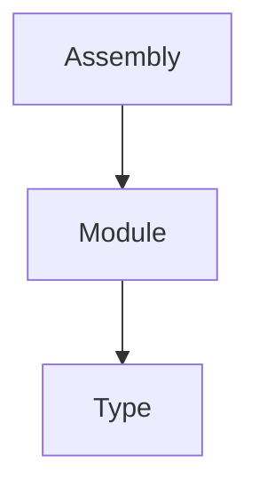
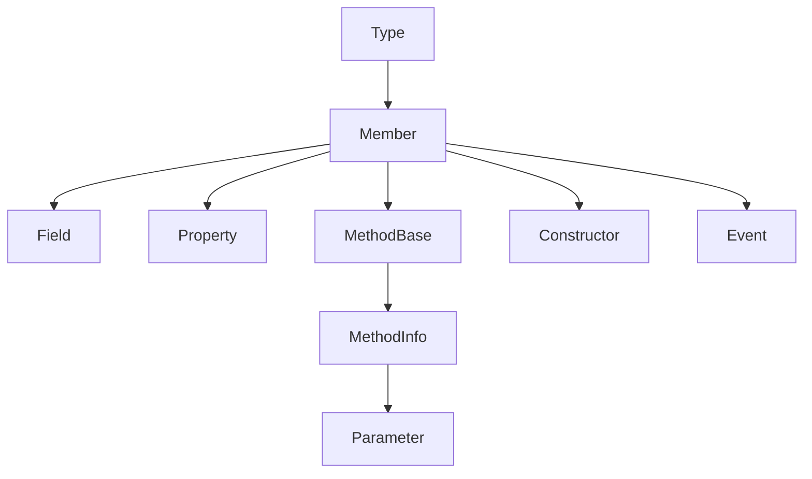

* RuntimeType 实现了Type
* instance use `GetType()` and class use `typeof` 

### Entities & Noteworthy
* Assembly
* Module
* TypeInfo
    * InvokeMember 万能 Invoke
* ConstructorInfo
* MethodInfo
    * GenerateDelegate
* FieldInfo
* EventInfo
* ProertyInfo
* ParameterInfo
* CustomAttributeData

### 对 Type 的命名规则
https://docs.microsoft.com/zh-cn/dotnet/framework/reflection-and-codedom/specifying-fully-qualified-type-names
 
### Tools 
* 动态代码创建类型/代码: System.Reflection.Emit - <https://docs.microsoft.com/zh-cn/dotnet/api/system.reflection.emit?view=netcore-3.1>
* obj 创建器Activator: https://docs.microsoft.com/en-us/dotnet/api/system.activator?view=netcore-3.1
    * Assembly.CreateInstance - alias
* 自定义 Binder: 比如 match method by signature 这种行为可以自定义的!
* `Delegate.CreateDelegate`动态创建 Delegate

### Framework Structure

### 查询方向
* Get[xxx] - downward
* Declaring[XXX] - upward
* BaseType - hierachy

* [how to retrive private field](https://stackoverflow.com/questions/95910/find-a-private-field-with-reflection)

### Builder
